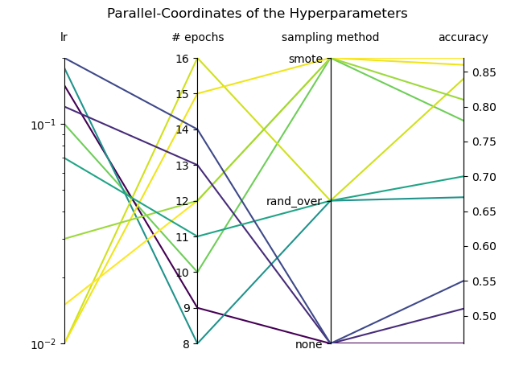

# Parallel Coordinates Plotting for Python `parcoords`

This package implements a parallel-coordinate plot, commonly used in machine learning, i.e. for hyperparameter visualization.

<p align="center">
  
</p>

## Installation
The `parcoords` package can be installed with pip:
```
pip install <package name>
```

## Usage
The following code produces the sample plot at the beginning of this page.
```python
import matplotlib.pyplot as plt
from parcoords.parcoords import plot_parcoords

# let's define some data to plot
values = [
    [0.1, 10, "smote", 0.78],
    [0.15, 9, "none", 0.46],
    [0.18, 8, "rand_over", 0.67],
    [0.01, 16, "rand_over", 0.84],
    [0.01, 15, "smote", 0.86],
    [0.015, 12, "smote", 0.87],
    [0.03, 12, "smote", 0.81],
    [0.12, 13, "none", 0.51],
    [0.07, 11, "rand_over", 0.7],
    [0.2, 14, "none", 0.55],
]

# plot the values as parallel-coordinate plot
plot_parcoords(
    values,
    labels=["lr", "# epochs", "sampling method", "accuracy"],
    color_field="accuracy",
    scale=[("lr", "log")],
    title="Parallel-Coordinates of the Hyperparameters",
)

plt.show()
```

## License
This repository is licensed under the [MIT-License](./LICENSE.txt).
